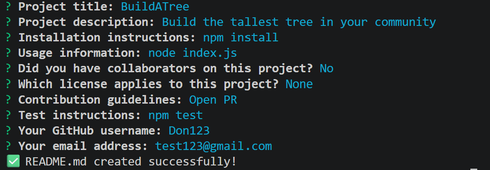

# Markdown-Magic

## Description

A Node.js command-line tool that auto-generates a professional, structured README.md file by walking you through a series of prompts.

- **Motivation**: Writing a good README from scratch every time is tedious and easy to skip.
- **Why this project**: Every serious project deserves documentation — this tool removes the friction so there's no excuse not to have one.
- **Problem it solves**: Eliminates the blank-page problem and ensures your README always hits the standard sections consistently.
- **What I learned**: Working with Node.js modules, the Inquirer.js prompt API, ES module syntax, dynamic markdown templating, and file system writes.

## Table of Contents

- [Description](#description)
- [Installation](#installation)
- [Usage](#usage)
- [Credits](#credits)
- [License](#license)
- [Features](#features)
- [How to Contribute](#how-to-contribute)
- [Tests](#tests)

## Installation

1. Clone the repository:
```bash
   git clone https://github.com/<your-username>/readme-generator.git
```
2. Navigate into the project directory:
```bash
   cd readme-generator
```
3. Install dependencies:
```bash
   npm install
```

## Usage

Run the generator from the root of the project:

```bash
node index.js
```

Answer each prompt in your terminal. When complete, a `README.md` will be created in your project root.



  


## Credits

https://github.com/HassanZafar-2021

## License

No License

## Badges


## Features

- Interactive CLI prompts via Inquirer.js
- Auto-generates all standard README sections
- Optional collaborator section with GitHub profile linking
- License badge and link auto-generated from your selection
- Input validation to prevent empty critical fields
- Sensible defaults for boilerplate sections

## How to Contribute

1. Fork the repository
2. Create your feature branch: `git checkout -b feature/your-feature`
3. Commit your changes: `git commit -m 'Add your feature'`
4. Push to the branch: `git push origin feature/your-feature`
5. Open a pull request

## Tests

No automated tests written. To manually verify, run `node index.js`, complete all prompts, and confirm the output `README.md` matches your inputs across all sections.
